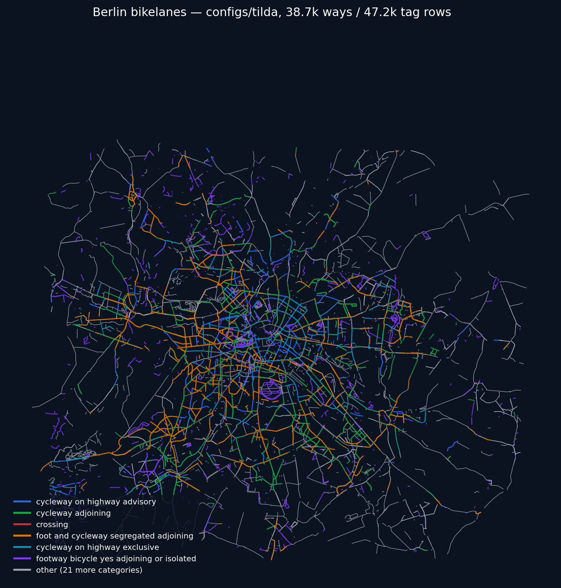
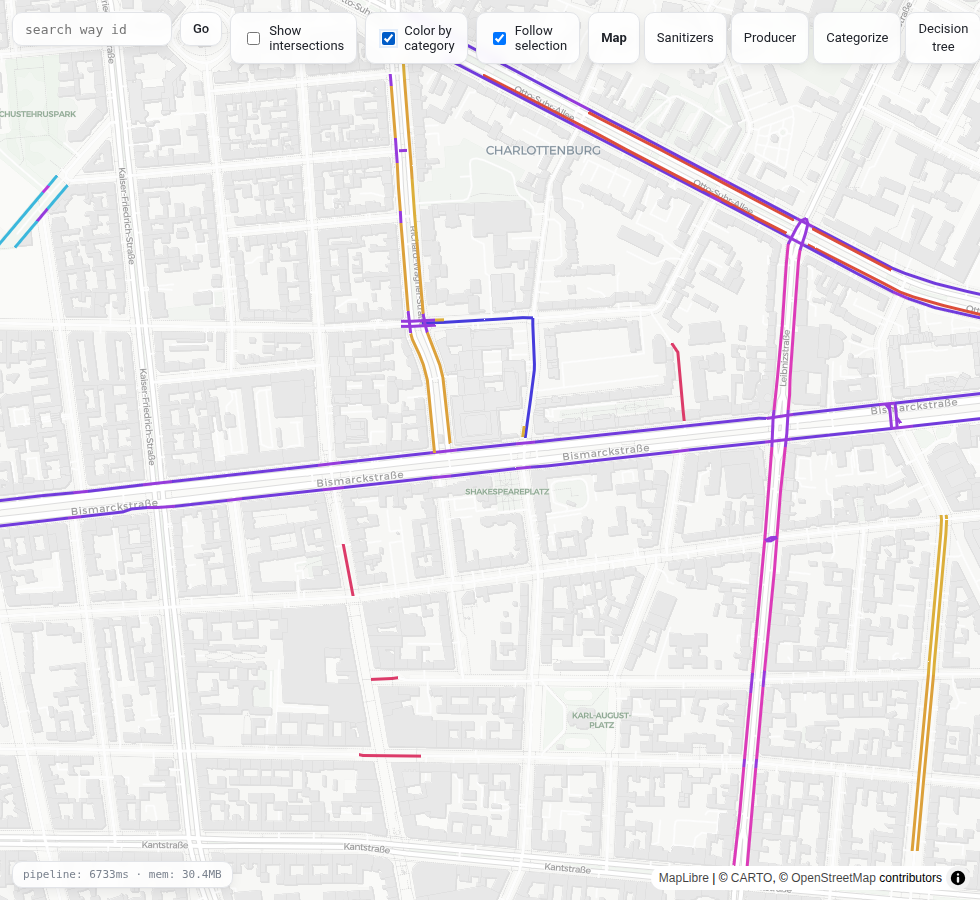

# OSMnexus

**Fast, in-memory OSM → graph extraction, driven entirely by data.**

OSMnexus reads a `.osm.pbf` extract and streams it straight into a normalized graph — tag
tables plus shared edge/node geometry — without touching disk for intermediate state. Peak
memory scales with the size of the **network you extract**, not the size of the planet: pulling
Berlin's bike network out of a Berlin extract costs what Berlin costs, independent of how large
OSM as a whole has gotten.

What counts as an edge, how tags get normalized, and which attributes get derived are not
hardcoded — they live in JSON config (`configs/`). The engine has no built-in idea of "road" or
"bike lane"; every network it can produce is a **pipeline you define**: categories that select
elements, sanitizers that clean values, producers that derive output columns. Point it at a
different config directory and it extracts a different graph from the same PBF.

```
                                       ┌─ way/*.json, node/*.json, relation/*.json (categories, pairwise-disjoint conditions)
 .osm.pbf ──▶ streaming reader ──▶ classify ──▶ sanitize ──▶ produce ──▶ {topic}
                            └────▶ geometries  ──▶ edges, nodes
```

## Why this exists

The engine (Rust, `src/`) knows how to stream a PBF, classify elements against a compiled
decision tree, and materialize graph output — the *network* is JSON, not Rust. Two bundled
configs show the range: [`configs/tilda`](configs/tilda) extracts a `roads`/`bikelanes` network,
and [`configs/osmnx`](configs/osmnx) extracts a driveable street network. Nothing about the
engine is road-specific — the same three building blocks (categories, sanitizers, producers)
extract a footpath network, a transit network, or a power grid just as well.

## Example: Berlin's bike network

`cargo run --release -- berlin.osm.pbf --config-dir configs/tilda --output geojsonseq` against a
115MB Berlin extract, in-memory, no database:



38,707 bikelane ways (47,223 tag rows, since some ways get left/right side-split ones) classified
into 26 disjoint categories in ~3 minutes wall clock on a single thread, peak RSS 1.6GB. Each
color above is one `way/*.json` category — `cycleway_on_highway_advisory`, `cycleway_adjoining`,
`crossing`, and so on — matched purely from tags, no geometry involved in classification.

The [live editor](editor/) can render the same per-category breakdown live against whatever bbox
you're iterating on — flip its "Color by category" toggle to swap from the default one-color-per-
topic view:



## The three building blocks

### 1. Categories — which elements belong, and as what

A category is a tag condition. `way/*.json`, `node/*.json`, `relation/*.json` files, one category
each, checked pairwise-disjoint at config load time (so there's never first-match ambiguity to
reason about) and compiled into a decision tree for evaluation:

```json
// configs/tilda/roads/way/bicycle_road.json
{
  "condition": { "tag": "bicycle_road", "eq": "yes" },
  "defaults": { "minzoom": 11 }
}
```

Bigger categories share logic via macros and can set per-category defaults for output fields —
e.g. a category can say "objects like me are one-way unless proven otherwise, and I'm not
confident about it":

```json
// configs/tilda/bikelanes/way/crossing.json (abridged)
{
  "condition": { "macro": "is_crossing_pattern" },
  "excludes": ["cycleway_link", "data_no", "separate_geometry"],
  "defaults": {
    "oneway": { "value": "implicit_yes", "annotate": { "confidence": "low" } }
  }
}
```

### 2. Sanitizers — cleaning a raw tag value

A sanitizer is a small, named, reusable transform chain — mapping, dropping, replacing — applied
to a raw OSM tag before it becomes an output value:

```json
// configs/tilda/sanitizers.json (abridged)
{
  "to_bool": { "mapping": { "yes": true }, "on_miss": "drop" },
  "traffic_sign": [
    { "drop": [""] },
    { "cases": { "none": ["no", "none"] }, "on_miss": "keep" },
    { "replace": [
        { "from": "DE: ", "to": "DE:", "at": "prefix" },
        { "from": "D:",   "to": "DE:", "at": "prefix" }
    ] }
  ]
}
```

### 3. Producers — deriving an output field

A producer is a small rule table (first match wins) that decides an output column's value —
often by reading multiple tags, falling through to category or topic defaults when nothing
matches. This is the actual `oneway` producer for `bikelanes`
([`configs/tilda/bikelanes/producers.json`](configs/tilda/bikelanes/producers.json)), as the
[live editor](editor/)'s own "Producer" tree tab renders it — not a mockup, a screenshot of the
real tool pointed at `bikelanes` → field `oneway`:

![Live editor's Producer tree view for bikelanes.oneway: a Match node branching into the category-scoped variant on the left (its own nested Match of 5 tag rules — oneway:bicycle=="yes" → Const "yes", oneway:bicycle=="no" and oneway=="yes" → Const "car_not_bike", oneway:bicycle=="no" → Const "no", oneway in [yes,no] → Extract key oneway, highway in [service,track] → Const "assumed_no") and the topic default on the right (Const "assumed_no" annotated confidence: high)](examples/img/oneway_producer.png)

```json
// configs/tilda/bikelanes/producers.json (abridged) — Option 1 in the screenshot
{
  "oneway": {
    "match": [
      { "when": { "tag": "oneway:bicycle", "eq": "yes" }, "value": "yes" },
      { "when": { "and": [{ "tag": "oneway:bicycle", "eq": "no" }, { "tag": "oneway", "eq": "yes" }] },
        "value": "car_not_bike" },
      { "when": { "tag": "oneway:bicycle", "eq": "no" }, "value": "no" },
      { "when": { "tag": "oneway", "in": ["yes", "no"] }, "value": { "tag": "oneway" } },
      { "when": { "tag": "highway", "in": ["service", "track"] }, "value": "assumed_no" }
    ]
  }
}
```

Option 2 — the `Const "assumed_no"` + `Annotate confidence: "high"` branch on the right — isn't in
`producers.json` at all. It's `bicycle_road`'s (and the other three categories this variant covers)
own per-category default, declared right next to that category's `condition`:

```json
// configs/tilda/bikelanes/way/bicycle_road.json (abridged)
{
  "condition": { "macro": "is_bicycle_road" },
  "defaults": {
    "oneway": { "value": "assumed_no", "annotate": { "confidence": "high" } }
  }
}
```

The tree renders both because a category default isn't a separate mechanism from a producer —
`TopicRunner::load` folds it in as that field's lowest-priority fallback rule, so "topic/category
producer, else this category's own default" is really just one `Match` with the JSON snippet above
as its first (always-attempted) branch and the category default as its second. That's also why the
image is a screenshot rather than hand-drawn from the JSON: the actual merged tree isn't visible in
any single config file, only in what `TopicRunner` resolves at load time.

Every field, category, and sanitizer in a topic can be visualized the same way straight from
config — `cargo run --bin plot_dag -- <topic> -o <dir>` walks the actual producer/sanitizer
trees `TopicRunner` resolves and emits Graphviz DOT (`dot -Tsvg` to render); `cargo run --bin
dag_json` emits the same trees, plus flat category order and the compiled decision tree, as JSON
— what the [live editor](editor/)'s browser-side tree views run on.

## How classification works

A topic classifies **all three OSM primitives** independently:

- **Ways** are selected by matching against `way/*.json` categories — a way is in the topic iff
  some category matches (after the topic's `exclude_condition` and shared transforms). Since
  categories are pairwise disjoint by construction, classification compiles once into a decision
  tree (branching on discriminating tags) and each element costs a handful of tag lookups, not a
  scan over every category.
- **Relations** work the other way: a relation matches a `relation/*.json` category by its own
  tags, independently of its member ways. Matching never pulls those ways into the topic's tag
  table or the shared `edges`/`nodes` graph — a member way that isn't *itself* matched by some
  `way/*.json` category stays out of both entirely. The only thing relation membership does is
  make member ways' coordinates available for **relation geometry** (`{topic}_relation_geom`) —
  and only that: if a topic doesn't declare a `"geometry_output": { "relation": ... }`, an
  unmatched member way's coordinates are never even read. The relation still gets its own tag row
  either way, linked to its member ways via `relation_members`.
- **Nodes** are classified too (`node/*.json` — barriers, crossings, traffic signals) but don't
  add edges themselves — a classified node forces a graph split, cutting the way that carries it
  even where only one way uses it.

Once selected, every element goes through the same enrichment order regardless of kind:
**transforms** (e.g. side-splitting a way into `left`/`right` cycleway objects) → **categorize**
(picks exactly one category) → **sanitize** (per-field cleanup) → **produce** (rule-based derived
output columns, categories may override which producer feeds a given column).

## Data model

One extracted graph; each topic is a disjoint attribute layer over it.

- **`<topic>`** — one tag row per (element, side, prefix): `osm_id, osm_type, id, osm, derived,
  private, meta`. Tag-only, no geometry — an element can appear in several topics with different
  classifications, so tag tables stay per-topic.
- **`edges`** — one row per (way, segment), shared across all topics: `osm_id, seg_idx, start_id,
  end_id, geom(LineString,3857), length_m, total_length_m, cost, reverse_cost`, cut at
  intersections and any classified node.
- **`nodes`** — one row per graph vertex: `id, osm_id, geom(Point,3857)`.
- **`{topic}_node_geom` / `{topic}_way_geom` / `{topic}_relation_geom`** — for a topic that
  declares a `"geometry_output"` for that kind: `osm_id, geom_type, geom, length_m`, one table per
  (topic, kind) regardless of shape — `geom_type` (`Point`/`LineString`/`MultiLineString`/
  `Polygon`) says which, so a node's own coordinate, a way's whole linestring or centroid, and a
  relation's assembled multipolygon all fit the same table shape. Built in-process during the
  streaming pass — no Postgres post-import SQL step, so every backend (`pg`, `csv`, `geojson`,
  `geojsonseq`) gets the same tables.
- **`relation_members`** — `relation_id` ↔ member `way_id` link table.

A topic that wants real routing weights (not just shared edge length) declares
`"graph": { "way": true }` plus `cost`/`is_directed` fields — orthogonal to `geometry_output` (a
topic can want both a routing table and a rendered line for the same ways) and the only geometry
concept that's still a post-load SQL step, producing a pgRouting-shaped `{topic}_edge` table with
`cost`/`reverse_cost` split proportionally across cut segments.

```sql
-- materialize by joining topic tags to shared geometry on osm_id
SELECT r.*, g.geom, g.length_m FROM roads r JOIN edges g USING (osm_id);
```

Classification is tag-only by design — no length/area/geometry predicates. Geometry-based
filtering belongs to a downstream stage, not the tag-classification pass.

## Quick start

```bash
# 1. Get an extract (any Geofabrik .osm.pbf)
curl -O https://download.geofabrik.de/europe/germany/berlin-latest.osm.pbf

# 2a. Files, no database — same schema either way
cargo run --release -- berlin-latest.osm.pbf --config-dir configs/tilda \
    --output geojsonseq --out-dir ./out

# 2b. Straight into PostGIS
export PGHOST=/var/run/postgresql PGDATABASE=geo PGUSER=me
cargo run --release -- berlin-latest.osm.pbf --config-dir configs/tilda --create-index
```

`RUST_LOG=info` in front of either gives per-phase timings. See
[`CLAUDE.md`](CLAUDE.md) for fast incremental dev builds (`cargo build --profile dev-fast`) — a
full `--release` build is ~60s+ by design and not meant for iterating.

### CLI flags

| flag | default | meaning |
|---|---|---|
| `<pbf_file>` (or `PBF_FILE`) | — | input `.osm.pbf` |
| `--config-dir <path>` | `configs/tilda` | topic config folder to run |
| `--output <backend>` | `pg` | `pg` (COPY into PostGIS), `csv`, `geojson` (+ `<topic>.geojson`), `geojsonseq` (+ streaming `<topic>.geojsonseq`) |
| `--out-dir <path>` | `out` | output directory (non-`pg` backends) |
| `--create-index` | off | build indexes after load (`pg` only) |
| `--topic-edges <mode>` | `pgrouting` | `{topic}_edge` shape for `"graph": { "way": true }` topics: `pgrouting` or `all` (+ tag columns) |
| `--db-writers <k>` | `4` | parallel COPY connections per table (`pg` only) |
| `--threads <n>` | `1` | rayon pool size for CPU-bound passes (`0` = all cores) |
| `--left-hand-traffic` | off | flip which physical side `forward`/`backward` reads from on side-split objects |
| `--tree-max-depth <n>` | `6` | max decision-tree branch depth; `0` skips compiling a tree at all and classifies by walking `categories.json` order linearly instead (debugging/perf comparison against the tree-based classifier) |

Database connection uses standard libpq env vars, overridable per flag: `PGHOST`/`--db-host`,
`PGDATABASE`/`--db-name`, `PGUSER`/`--db-user`, `PGPASSWORD`/`--db-password`, `PGPORT`/`--db-port`.

## Defining your own network

Each topic lives under `<config-dir>/<name>/` and is pure data — no Rust changes needed:

- `topic.json` — table name, transforms, osm fields, sanitizers, producer bindings, geometry
  shapes, exclude condition.
- `way/*.json`, `node/*.json`, `relation/*.json` — one category each, pairwise-disjoint
  conditions.
- `producers.json`, `sanitizers.json`, `macros.json` — output-field rule tables, reusable value
  transforms, reusable condition fragments.

Shared macros/sanitizers/producers/value-sets across topics live in `<config-dir>/_shared/`. Copy
`configs/osmnx` as a minimal starting skeleton, or `configs/tilda` for a config with real depth.

## Dev tools (`src/bin/`)

- `check_overlaps` — lint every topic's categories for pairs that could match the same object
  without excluding each other.
- `plot_dag -- <topic> [-o <out-dir>]` — render a topic's producer/sanitizer trees as Graphviz
  DOT, one file per output field per distinct resolved producer.
- `dag_json -- <config-dir> <topic> [category|decision-tree]` — the same trees (default), flat
  category-priority order, or the compiled decision tree, as JSON — feeds the live editor's
  browser-rendered tree views.

## Live editor

[`editor/`](editor/) is a local web app for iterating on category/topic JSON against a real map:
pick a bbox, edit a condition or field in a JSON editor, save, and the pipeline reruns (`--source
csv --output csv`) with the map re-rendering — no manual CLI round-trips. The map defaults to one
color per topic, since usually only one topic is loaded at a time; toggle "Color by category" to
break that topic's features out by category instead (see the Berlin/Charlottenburg screenshot
above). See [`editor/README.md`](editor/README.md).

## Layout

```
src/          engine (classify, transforms, DB/output writers), reader, main
src/bin/      dev-tool binaries (config linting, DAG export) — see Dev tools above
src/geom/     geometry output: per-topic GeometryPlan + in-process materialization
configs/      data-defined config directories (tilda, osmnx, ...)
editor/       live editor — local web app for iterating on topic/category JSON against a map
examples/     standalone rendered examples referenced from this README
BACKLOG.md    deferred ideas / performance notes
```

## Attribution & license

Derived from [tilda-geo](https://github.com/tordans/tilda-geo). Licensed under the **GNU AGPL
v3** — see [LICENSE.md](LICENSE.md).
